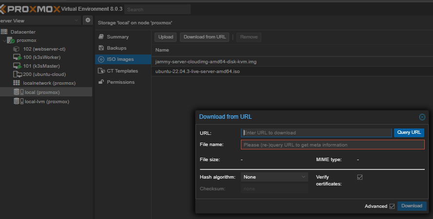
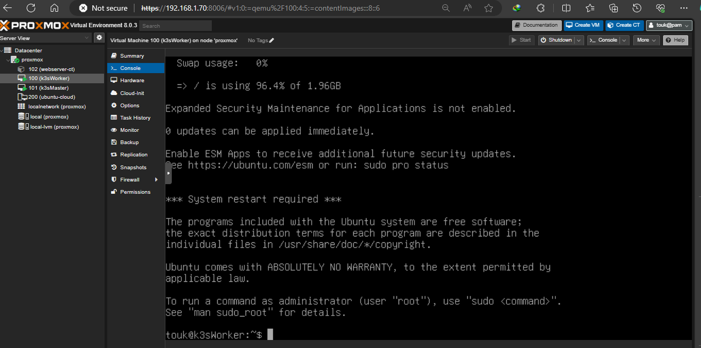

### BEFORE YOU START
The cloud init template must be created in advance, the VMs will use it to create a full clone of it

### Download the ubuntu cloud image from the official site
* Can be found here: [Cloud init image link](https://cloud-images.ubuntu.com/)

* Upload it to your proxmox

### Run the cloud-init script

### Make the necessary change for your customized cloud-init